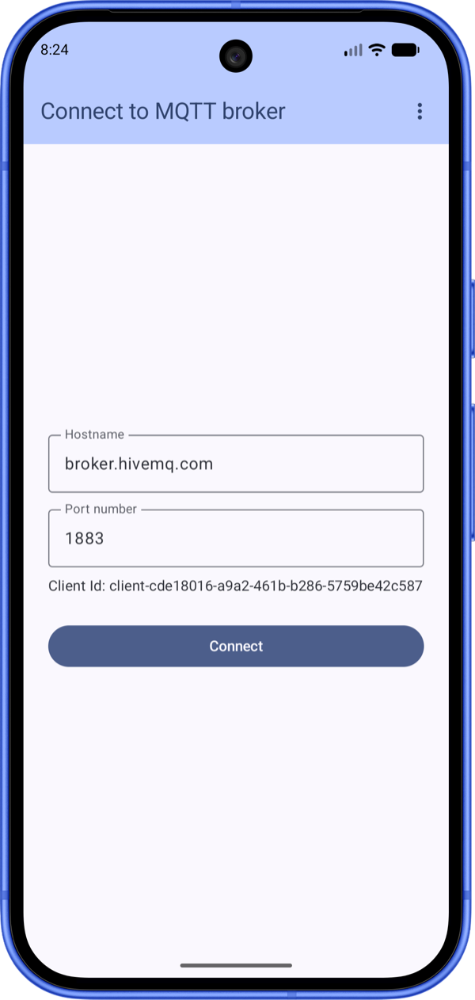
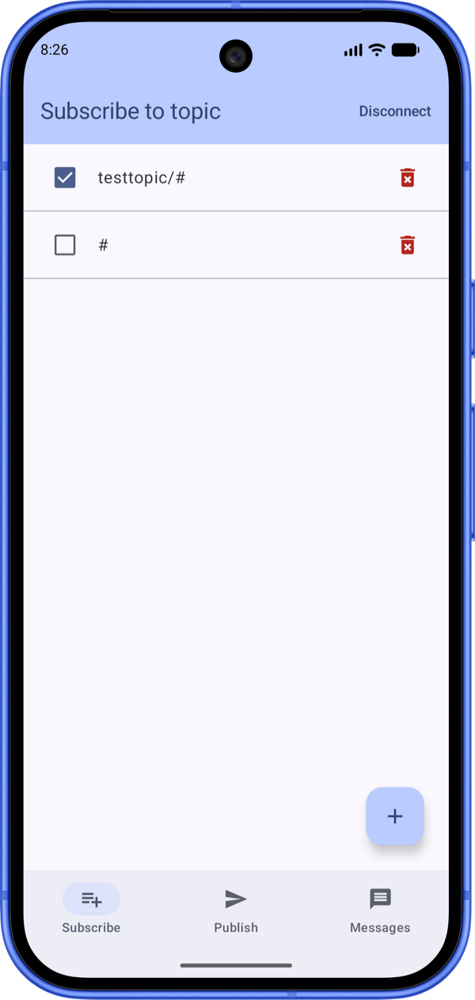
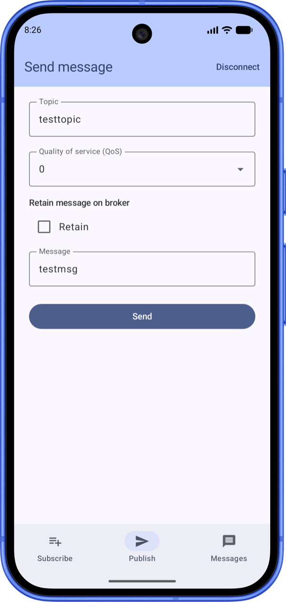
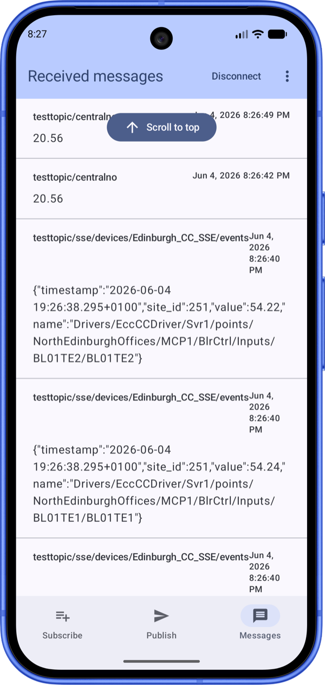

# Android MQTT Client App

A lightweight mobile [MQTT](https://mqtt.org) client for Android. Useful if you want to:

- explore and learn how the MQTT protocol works
- debug and test existing MQTT infrastructure
- have a simple communication with IoT devices

For testing, pair the app with the [HiveMQ WebSocket client](https://www.hivemq.com/demos/websocket-client/?).

### 1. Getting started

#### 1.1 Run the app

1. Make sure the device or emulator has internet access.
2. Run the app and connect to a broker — use the **Default broker** option to connect to the HiveMQ public broker instantly.
3. Subscribe to a topic — `testtopic/#` is offered as a default.
4. Publish custom messages and watch incoming messages arrive.

#### 1.2 Test against a counterpart

1. Open the [HiveMQ WebSocket client](https://www.hivemq.com/demos/websocket-client/?).
2. Set up a simple test client and exchange messages with the app.

### 2. Features

**Core**
- **Connect** to an MQTT broker
- **Subscribe** to topics
- **Publish** custom messages
- **Receive** and monitor incoming messages live

**Quality of life**
- Bookmark recent brokers for one-tap reconnect
- Bookmark previously subscribed topics for quick reuse
- "Scroll to top" button on the received-messages list
- MQTT errors surfaced via Snackbars

### 3. Tech stack

- **Language:** Kotlin (JDK 17)
- **UI:** Jetpack Compose + Material 3, single-Activity with Navigation-Compose
- **Architecture:** MVVM — ViewModels + StateFlow, layered `data` / `domain` / `ui`
- **DI:** Koin
- **Persistence:** Room (recent brokers, subscribed topics)
- **MQTT:** HiveMQ MQTT client
- **SDK:** min 24, target 36

### 4. Screenshots

